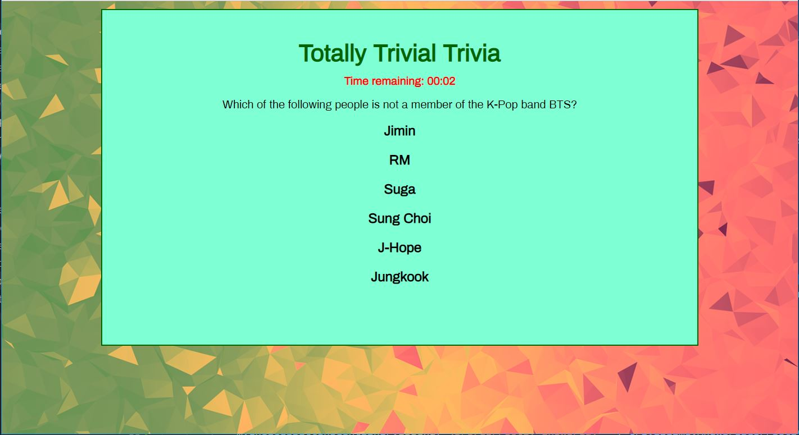

# TriviaGame
Week 5 homework assignment
### Overview
This project focuses on creating a simple trivia game that depends on the use of timers in an interactive web page using JQuery, Javascript, HTML and CSS.

### Purpose
The project taught us how to use timers in javascript to control the flow of action on the web page after each question was answered or no answer was provided in a specified period of time.

### Game Description
The game is by selecting one the 6 possible choices for each trivia question. Each question has a limit of 10 seconds to provide an answer. When a question has been answered or the timeout period has expired, the game will inform the user what the correct answer is and then move to the next question. After all questions have been answered, the game will provide a summary of how well the player did by displaying the number of correct, incorrect and unanswered questions during the game.

This project is maintained by Peter Tag

